# One button game

## Mark Johnson - Developer, Podcaster, Geek

https://indieweb.social/@marxjohnson

---

# What?

<!--
* What is a one-button game?
* A game that only accepts a input from a single button to control it.
-->

---

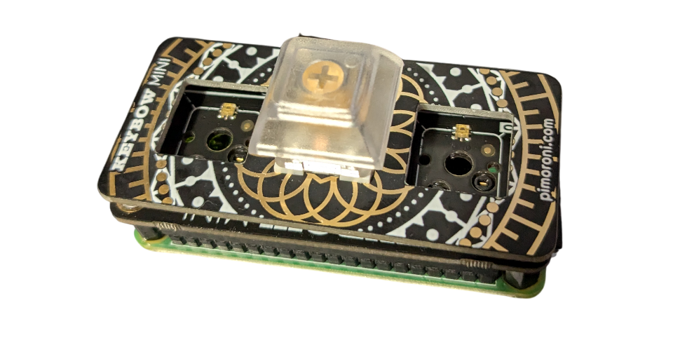

<!--
* Could be a single keyboard key, mouse button, button on a game controller, etc.
* I will point at this time that I am a web developer, not a game developer. This will become apparent.
-->

---

# Why?

<!--
* My friends and I occasionally like to do a game jam, where we challenge each other to make a game.
* It's good to put some restriction on the game to focus our efforts, limit the scope and encourage creativity.
* If you've seen me talk before, you might remember we once challenged each other to write a game in a Bash script.
-->

---

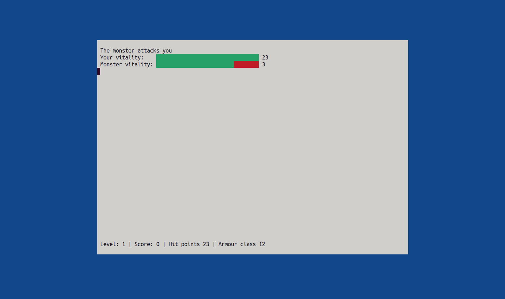

<!--
* Beyond the contrived reasons, a one-button game is maximally accessible.
* The simplest input device is a "single switch" interface, for use by people with limited movement or motor control.
-->

---

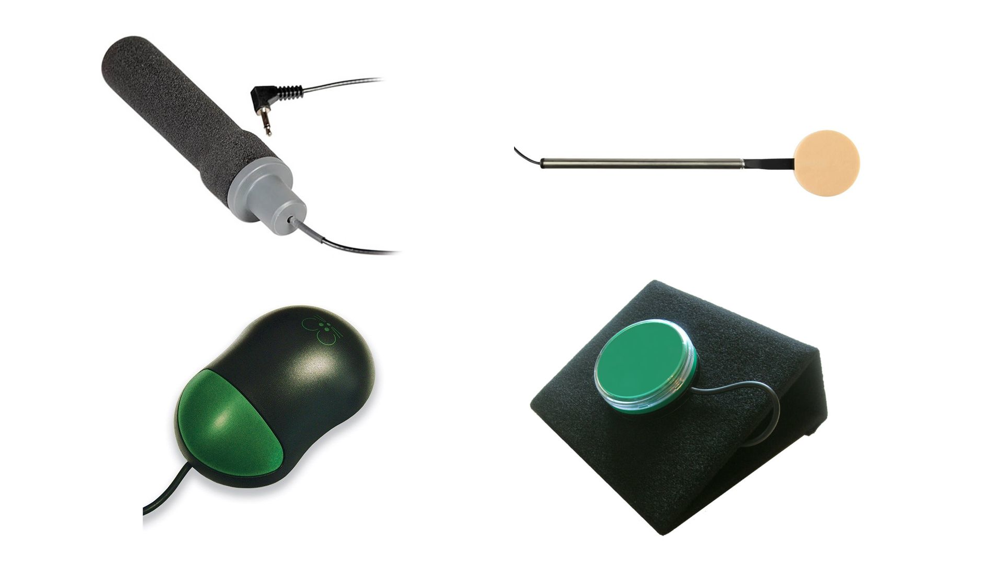

<!--
* They take various forms, big button, small switch.
* One button, that's pressed or not.
-->

---


<!--
* A famous example is Stephen Hawking, who controlled his computer by twitching his cheek, with the aid of a special camera.
-->

---

# What game should I make?

<!--
* A game needs and element of challenge to it. What is challenging about pressing a single button?
* I could think of 2 factors - speed and accuracy.
* Games where you press a button a quickly as possible exist - "cookie clicker"
-->

---

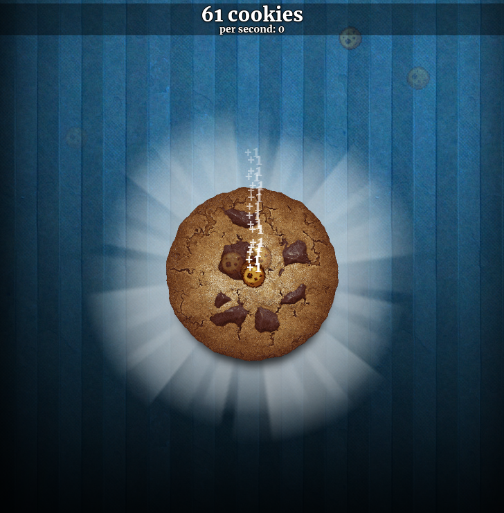

<!--
* I couldn't think of anything more interesting for speed, so I started thinking about accuracy.
* At the time I was playing a game called Crypt of the NecroDancer.
-->

---

[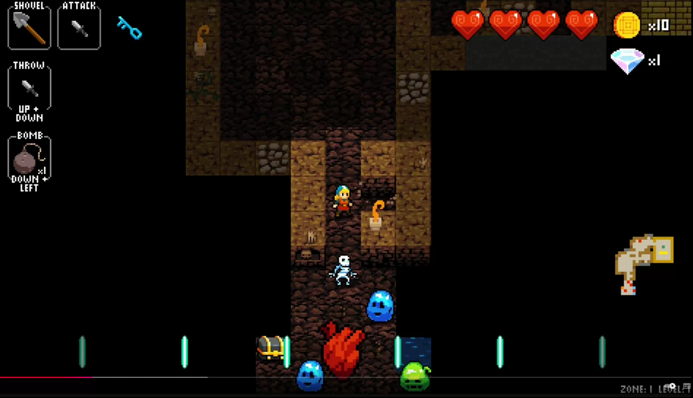](necrodancer.webm)

<!--
* It's a rogue-like dungeon-crawler where you have to move to the beat of the music.
* Each enemy dances in a different pattern, You need to learn the pattern and hit the enemy when its not moving to kill it.
-->

---

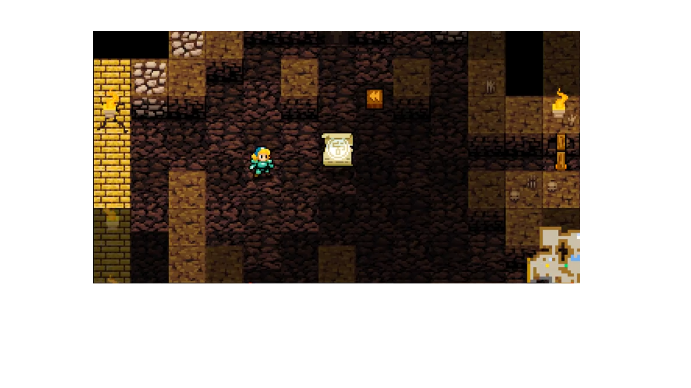

---

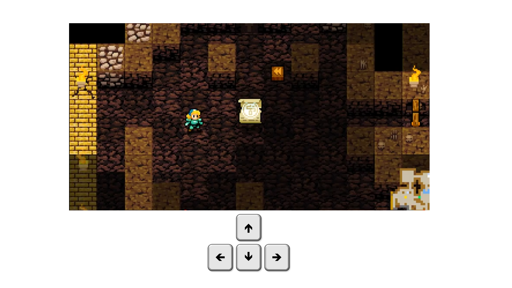

<!--
* You control it with the 4 direction keys or buttons, moving up-down-left-right in time with the beat.
-->

---

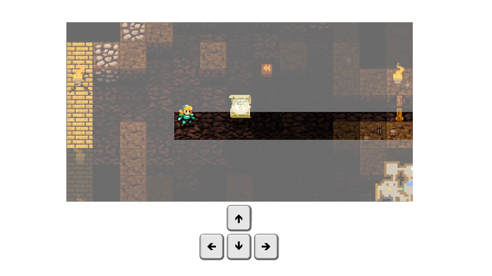

<!--
* So I thought, if I only moved in one direction instead of 4, I'd only need 1 button!
-->

---

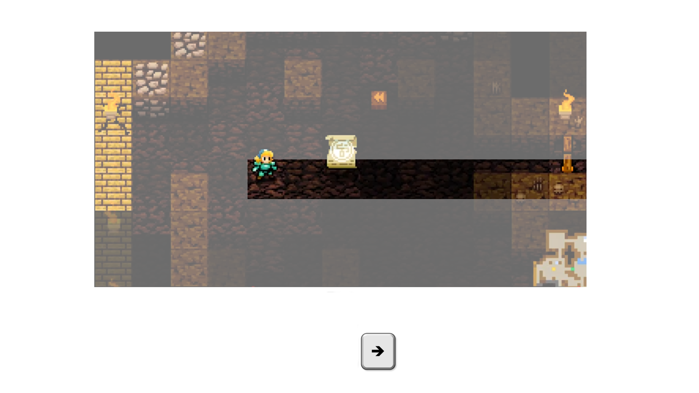

<!--
* This was my concept - make a game a bit like CotND, but with 1-dimensional levels.
-->

---

# How?

<!--
* I started looking at game engines.
* I would need a way to display a corridor, enemies and the player character.
* I would need to play some music, at least a basic beat.
* When the player presses a button, I would need to tell if it was in time with the beat, and move the character.
* If you're not already a game developer, most engines have a pretty steep learning curve. I realised I would spend all the time I had free just learning now to use an engine.
* Then I realised I already knew a platform that could display graphics, play sounds and respond to user input
-->

---


<!--
* The web.
* So I decided to write the game to run in a web browser.
* I got a bit hung up on graphics at first.
-->

---
<!--
_footer: https://zerie.itch.io/tiny-rpg-character-asset-pack
-->
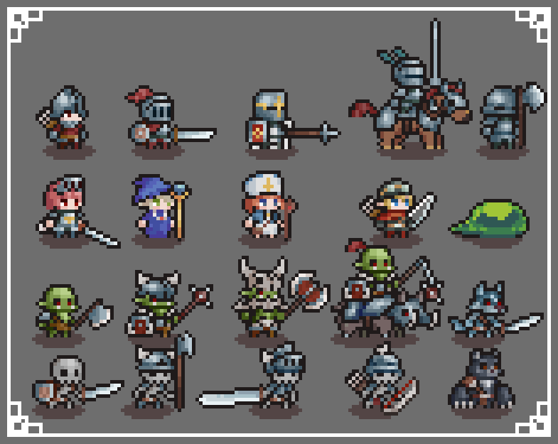


<!--
* Thinking of NecroDancer, I started looking for free assets with pixel art characters and monsters.
* I realised that displaying an animating these nicely was going to be a lot of work.
* So I started to think outside the box. If I'm working with the web, I can easily draw and animate shapes with SVG.
-->

---


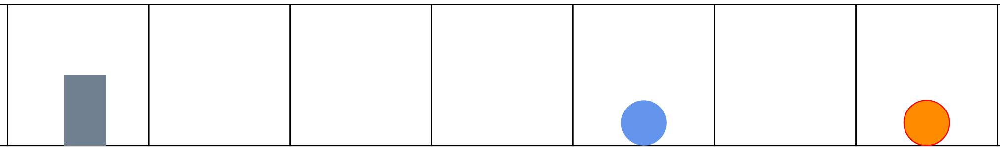

<!--
* But who would want to play a game where all the characters were simple shapes?
* Then I remembered I'd played a game just like that.
-->

---


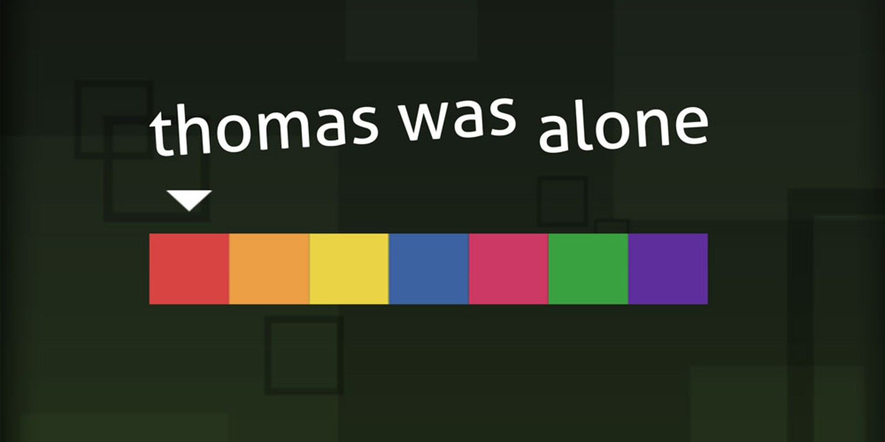

<!--
* In 2012 indie game Thomas was Alone, the title character was a rectangle.
* That won a BAFTA.
* I think I'm on to a winner.
-->

---

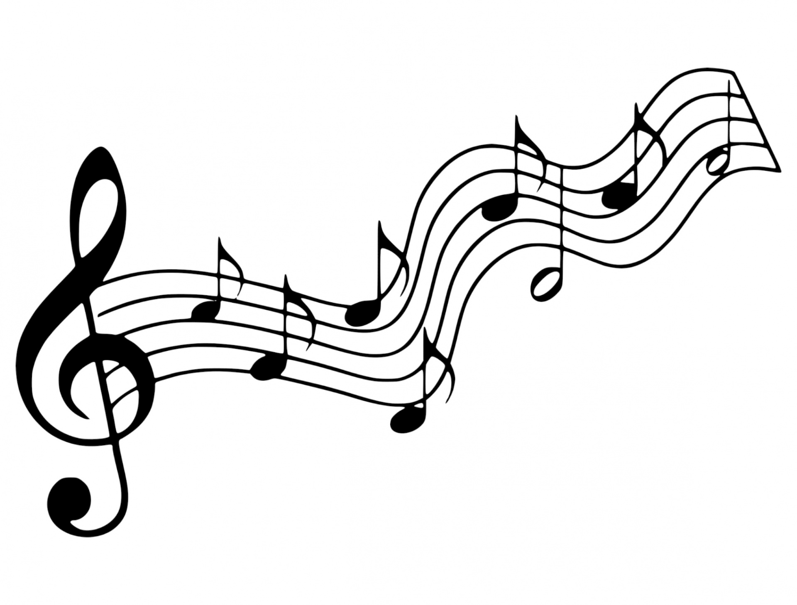

<!--
* Next I had to look at music. This was going to be easy bit
-->

---

```html
<audio src="soundtrack.mp3">
```

<!--
* I figured I could play pretty much whatever audio I wanted using the HTML Audio element.
-->

---

```html
<audio src="soundtrack.mp3" ontimeupdate="notifyBeat()">
```

<!--
* Bonus: Audio elements emit a timeupdate event as the audio is played! This is going to be easy, if I know the tempo of the music, I can just listen for these events and set a flag as we pass each beat, right?
-->

---

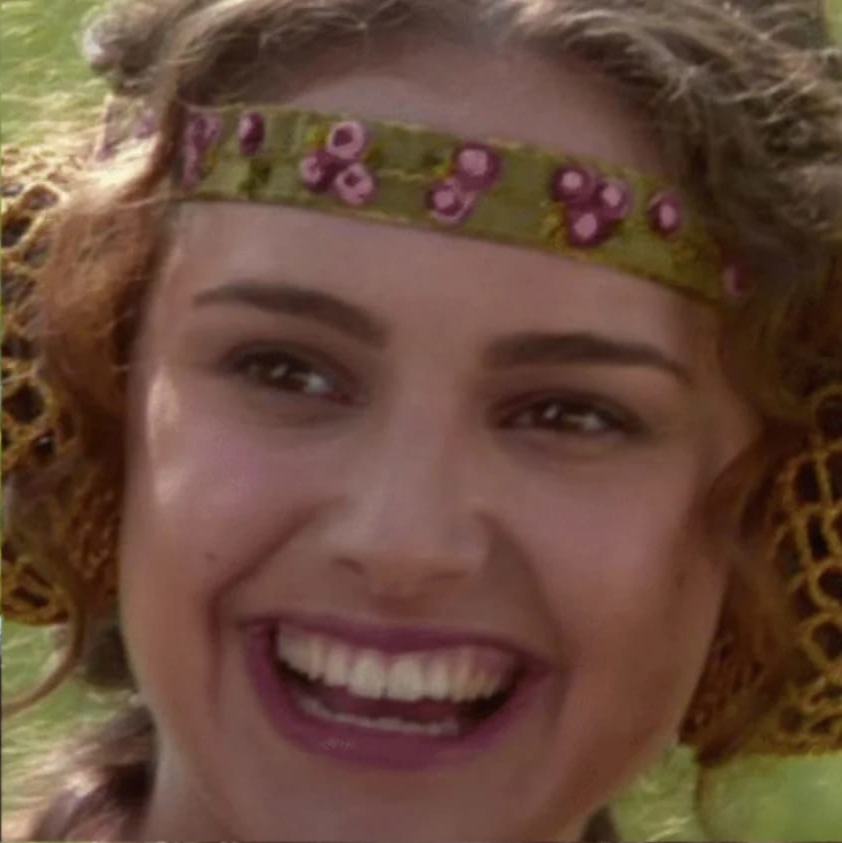
<!--
* Right?
-->

---
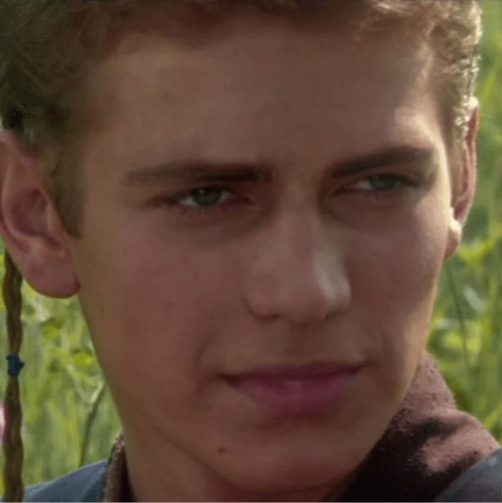

<!--
* No.
-->

---

```
e.timeStamp: 1888
e.timeStamp: 2170
e.timeStamp: 2455
e.timeStamp: 2737
e.timeStamp: 3019
e.timeStamp: 3302
e.timeStamp: 3584
e.timeStamp: 3867
e.timeStamp: 4150
e.timeStamp: 4435
e.timeStamp: 4717
e.timeStamp: 5004
e.timeStamp: 5286
e.timeStamp: 5573
e.timeStamp: 5857
e.timeStamp: 6141
e.timeStamp: 6423
e.timeStamp: 6707
e.timeStamp: 6992
e.timeStamp: 7276
e.timeStamp: 7559
e.timeStamp: 7841
e.timeStamp: 8135
e.timeStamp: 8410
```
<!--
* timeupdate is not fired at regular intervals, it fires when it feels like it and tells you the current playback position. Useful for updating a progress bar, not useful for beat matching.
* I quickly realised if I was going to need to do accurate beat matching, I would need to generate the music myself.
-->

---


<!--
* Fortunately, Tone.js exists for this purpose.
* I mentioned I am not a game developer, nor am I a musician.
* I understand Tone just well enough to do what I needed to do, produce a simple drum beat at a given tempo.
-->

---

[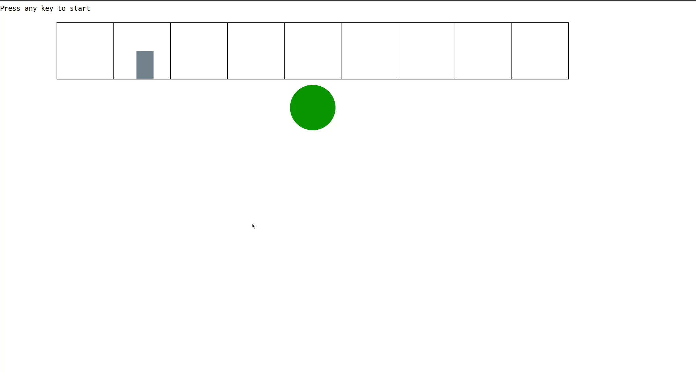](tothebeat.webm)

<!--
# Putting it together

* The game starts, the music starts playing.
* When each "beat" is played, an event is fired.
* We set an HTML class on the body element, wait a bit, then remove it.
* The actual time we wait is a bit tricky. We want to wait long enough that it's possible for a human to hit the beat accurately, but it still be a challenge. There's a bit of maths that tries to make it so that as the tempo is faster, the time you have to hit the beat is shorter, but the proportion of each bar that time covers is a bit longer to make it more managable.
* When the user presses the key (actually any key), we check if the beat is "on".
* If it is, they move forwards.
* If not, they get a "miss".
* When they reach an enemy, they have to watch for the right moment to jump. Each enemy has a shield which appears and disappears in a pattern. They have to jump when the shield is down, or the bounce off.
* When they finish the level, they get a score.
-->

---

```svg

<body class="beaton">

<circle class="mob purpleblob unsafe" r="20" cx="50" cy="50">

<g id="player" class="jumping">
    <rect class="body"></rect>
</g>

```

<!--
* All the animation is achieved with CSS. Javascript adds and removes classes, but doesn't change any positions.
-->

---

```css
.mob {
    stroke: none;
    transition: transform 0.1s;
}
.beaton .mob {
    transform: translate(10px, 20px) scale(.8, .8);
}
@keyframes jump {
    from {
        transform: translate(240px, 50px);
    }
    50% {
        transform: translate(240px, 0px);
    }
    to {
        transform: translate(240px, 50px);
    }
}
#player.jumping {
    animation-name: jump;
    animation-timing-function: ease-in-out;
    transform: translate(240px, 0px);
}
```

<!--
* Almost everything uses CSS transitions. Only the jumping player needed keyframe animation, as it's tricky to sync it up with the scrolling rooms.
-->

---

```css
.cell:nth-child(1) {
    transform: translateX(0);
}

.cell:nth-child(2) {
    transform: translateX(100px);
}

.cell:nth-child(3) {
    transform: translateX(200px);
}
```

<!--
* As the player "forwards" or "backwards", a room is added to one and and removed from another. Some nth-child CSS is used to make the corridor scroll along as this happens.
-->

---

```javascript
function beatOn() {
    beatNow = true;
    tooSoon = false;
    document.body.setAttribute('class', 'beaton');
}
function beatOff() {
    beatNow = false;
    document.body.setAttribute('class', 'beatoff');
    window.setTimeout(() => {
        tooSoon = true;
    }, (1 / (bpm / 60) / 8) * 1000)
}
```

<!--
* Everything that pulses to the beat is in response to a single "beaton" class added and removed from the body tag.
-->

---

```javascript
export class yellowBlob extends mob {
    pattern = [this.SAFE, this.SAFE, this.SAFE, this.UNSAFE];

    constructDomElement() {
        this.domElement = document.createElementNS(
            'http://www.w3.org/2000/svg',
            'circle'
        );
        this.domElement.setAttribute('class', 'mob yellowblob');
        this.domElement.setAttribute('r', 20);
        this.domElement.setAttribute('cx', 50);
        this.domElement.setAttribute('cy', 80);
    }
}
```
<!--
* An enemy is defined like this, an SVG shape and a pattern of safe/unsafe beats.
-->

---

```javascript
export const rooms =
{
    14: {
        contents: new roomContents.blueBlob()
    },
    28: {
        contents: new roomContents.yellowBlob()
    },
    32: {
        contents: new roomContents.yellowBlob()
    },
    38: {
        contents: new roomContents.purpleBlob()
    },
    40: {
        contents: new roomContents.boss()
    }
};
```
<!-- 
* A level is defined like this, a Javascript object of which rooms are occupied, the empty rooms are filled in between.
* For my prototype there's just one level, it would be pretty easy to generate a lot of these.
-->

---


<!--
* A simple game can still be fun and challenging
* You don't have to be a game developer to make a game
* You can always work with what you know, you can always improve it later.
-->

---

<!--
_footer: 
-->

# One button game

https://marxjohnson.github.io/tothebeat/
https://indieweb.social/@marxjohnson
https://linuxmatters.sh

